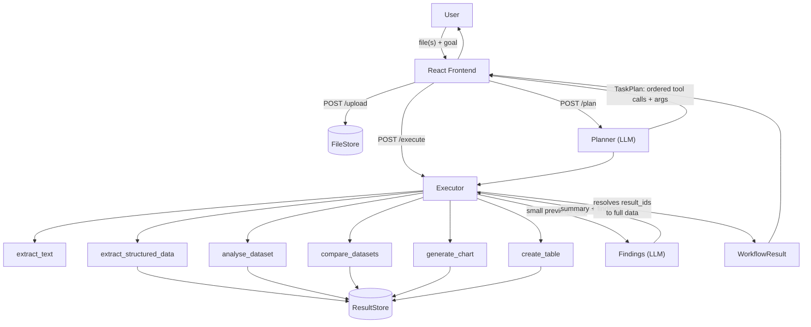
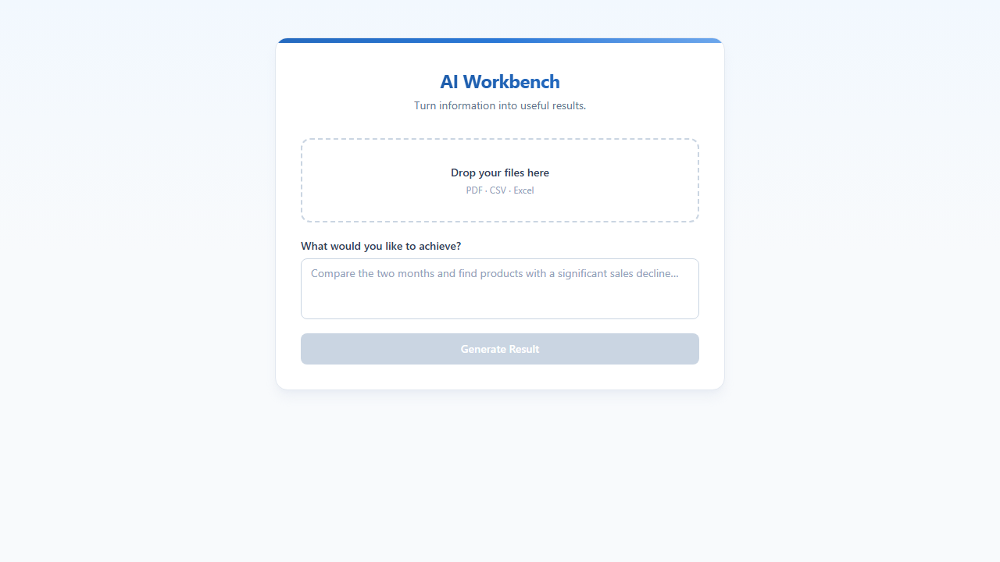
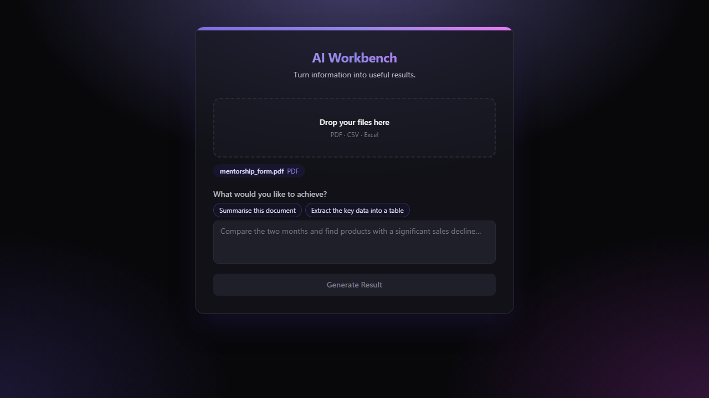
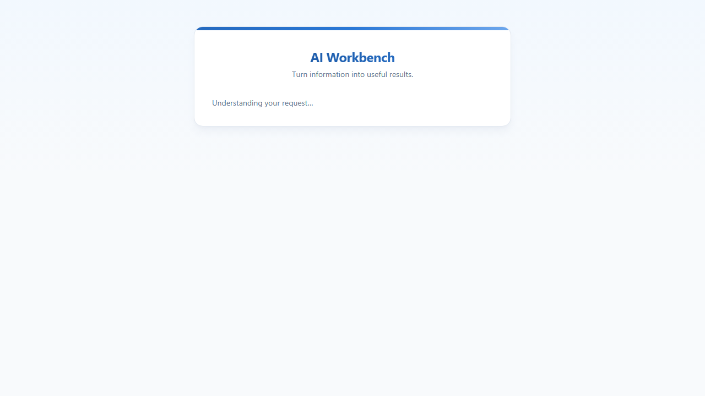
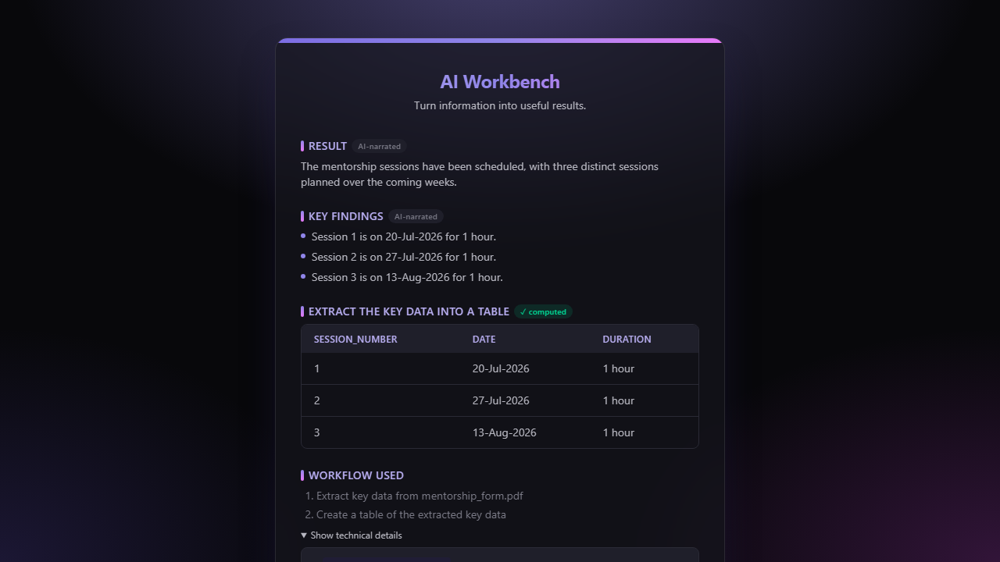

# AI Workbench

**Turn uploaded files into useful results — automatically.**

Upload a PDF, CSV, or Excel file, describe what you want in plain language, and AI Workbench plans a workflow, executes it, and hands back a summary, a table, a chart, or a finding. Built for [GIBC V2](https://gibc-v2.devpost.com/), Track 03 (Open).

## The problem

Getting an actual answer out of a spreadsheet or report usually means several manual steps: open the file, understand its columns, do the calculation, filter the results, maybe build a chart. AI Workbench collapses that into one step: **upload → describe your goal → get the result.**

It is deliberately *not* a general-purpose chatbot or agent. It only does five things, on files you give it:

| Capability | What it means | How it's built |
|---|---|---|
| **Understand** | Summarise or answer questions about a document | `extract_text` (PDF) — the model reads the real text and synthesises an answer, no separate "summarise" tool needed |
| **Analyse** | Calculations, filters, comparisons on structured data | `analyse_dataset`, `compare_datasets` — pandas does the arithmetic, never the LLM |
| **Transform** | Turn unstructured or raw data into a real structured result | `extract_structured_data` pulls a table out of a PDF (e.g. line items, sessions, dates) into the same result store CSV/Excel data gets — so a document's data can flow into `create_table`/`generate_chart`/`analyse_dataset` too, not just prose |
| **Visualise** | Turn data into a chart | `generate_chart` — shapes the data; actual rendering happens client-side in React |
| **Decide** | Call out the finding that actually matters | A second, small LLM call that narrates already-computed results — not a tool, since this is exactly what an LLM is naturally good at (unlike arithmetic) |

The `extract_structured_data` addition exists because of a real gap found by testing the app on an actual document: without it, "Understand" could only ever produce prose for a PDF — indistinguishable from asking ChatGPT. Now a document's data can be extracted into a real table with computed totals, not just summarised.

## How it's different from just asking ChatGPT

A chatbot turns a question into an answer. AI Workbench turns a **goal** into an **executable plan**, then runs it:

```
goal + files → AI plans a sequence of tool calls (with real arguments)
            → the plan is executed deterministically (pandas/PyMuPDF do the work)
            → a second LLM call narrates the already-computed result
            → table / chart / summary / findings
```

The plan the user sees *is* what executes — not a decorative summary of what an independent agent did. See [Architecture](#architecture) for why that distinction mattered enough to build around.

## Architecture



Three decisions carry the whole design:

1. **One plan, deterministically executed.** The planner LLM produces a `TaskPlan` of concrete tool calls (tool name + real arguments), not prose. A plain Python executor runs each call in order — no second, independent agent re-deciding what to do. What the UI shows as "workflow used" is literally what ran.
2. **Bulk data never round-trips through the LLM.** Tools that compute a table (`analyse_dataset`, `compare_datasets`, `extract_structured_data`) store the full result server-side and hand the LLM only a `result_id` + a 5-row preview. Later steps reference `$result_of_step_N` instead of the LLM re-typing data. The final result's full rows are resolved from the store at the API layer — the LLM never authors the numbers a user sees, it only decides what to compute and narrates the outcome.
3. **A computed result is never silently dropped.** If a plan computes something but never explicitly calls `create_table`/`generate_chart` on it (verified empirically: the model doesn't reliably remember that last step), the executor surfaces the most recent result anyway. The reliability principle isn't just "don't trust the LLM with numbers" — it's "don't trust the LLM to remember to show its work" either, and the system should degrade to showing *something concrete* rather than prose alone.

## Tech stack

| Layer | Technology |
|---|---|
| Frontend | React, TypeScript, Vite, Tailwind CSS v4, Recharts |
| Backend | FastAPI |
| AI | [Pydantic AI](https://ai.pydantic.dev/), OpenRouter (`openai/gpt-4o-mini`) |
| Data | pandas, openpyxl |
| Documents | PyMuPDF |
| Testing | pytest (42 tests, backend fully covered) |

## Project structure

Here's a map of the codebase, grouped by what each part is actually for.

```
backend/                   The API and all the "thinking" — a FastAPI app
├── main.py                 The API itself: /upload, /plan, /execute endpoints, plus error handling
├── models.py                Every data shape used across the app (a file, a plan, a tool call, a result)
├── agent/
│   ├── planner.py            Turns a goal + files into a step-by-step plan, using an LLM
│   ├── prompts.py             The actual instructions given to the LLM (what each tool does, how to use it)
│   └── executor.py            Runs a plan for real: calls each tool in order, then asks the LLM to write a summary
├── tools/                   The six things the system can actually do — one file each
│   ├── document_tools.py       Read a PDF's text, or pull a structured table out of one
│   ├── data_tools.py            Do the real math on a CSV/Excel file (pandas, not the LLM)
│   ├── output_tools.py           Shape a result into a table or a chart
│   └── _common.py                 A tiny shared helper (cleans up data so it's safe to send as JSON)
└── services/                 Where uploaded files and computed results are kept in memory
    ├── file_service.py         Stores uploaded files and remembers their type/name
    └── result_service.py        Stores the output of every tool call so later steps can reuse it

frontend/                  The React app people actually see and click through
└── src/
    ├── App.tsx                  The whole page's flow: upload → describe your goal → see the result
    ├── api.ts                    Talks to the backend (the fetch calls)
    ├── types.ts                   TypeScript versions of the backend's data shapes, kept in sync by hand
    └── components/
        ├── Dropzone.tsx             The file upload box
        ├── GoalInput.tsx             The text box where you describe what you want, plus suggestion chips
        ├── ProgressChecklist.tsx      The "thinking..." progress bar and step list
        ├── ResultView.tsx             Shows the summary, findings, table, and chart once a result is ready
        ├── DataTable.tsx               Renders a table
        └── Chart.tsx                    Renders a chart (bar / line / pie)

tests/                    Automated tests — every one of these actually runs against real files
├── test_planner.py         Checks the planner builds sensible plans and prompts
├── test_execute.py          Checks a full plan actually runs and produces the right result
├── test_tools.py             Checks each of the six tools individually
├── test_upload.py             Checks file upload handles good and bad files correctly
├── test_demo_scenarios.py     The four demo scenarios from the video, proven to work before they're recorded
└── conftest.py               Shared test setup (loads the API key so tests use the real model, not a stub)

examples/                 Real example files to try the app with, plus the script that generates them
├── generate_examples.py    Regenerates every file below from scratch, so they're always reproducible
├── reports/                 Example PDFs (an annual report, a training session log)
├── sales/                    Two months of example spreadsheets, for the "compare and find declines" demo
└── datasets/                  An example CSV, for the "chart the trend" demo

requirements.txt          Python dependencies for the backend
.env.example               Template for the backend's API key — copy to .env and fill in your own
```

`frontend/` also has its own config files (`vite.config.ts`, `tsconfig*.json`, `package.json`) — standard tooling setup, nothing project-specific to explain.

## Setup

One-time setup for each side, before first run.

**Backend:**

```bash
python -m venv .venv
.venv\Scripts\activate        # Windows
pip install -r requirements.txt
cp .env.example .env          # add your own OPENROUTER_API_KEY to use a real model
```

Without `OPENROUTER_API_KEY`, the planner runs against Pydantic AI's `TestModel` (schema-valid stub output, no network call) — the app still runs end-to-end for development without a key.

**Frontend:**

```bash
cd frontend
npm install
cp .env.example .env          # optional: override VITE_API_BASE_URL
```

## Running it

Needs two terminals open at once — the backend API and the frontend dev server are separate processes.

**Terminal 1 — backend:**

```bash
uvicorn backend.main:app --reload
```

Serves the API at `http://127.0.0.1:8000` (interactive docs at `http://127.0.0.1:8000/docs`).

**Terminal 2 — frontend:**

```bash
cd frontend
npm run dev
```

Open **http://localhost:5173** in your browser (use `localhost`, not `127.0.0.1` — the dev server only answers on the hostname).

**To stop either one:** `Ctrl+C` in its terminal.

To try it without the frontend at all, use `http://127.0.0.1:8000/docs` directly, or drive the real example files under [`examples/`](examples/) — four scenarios (summarise a PDF, compare two spreadsheets, chart a trend, extract a table from a PDF) are verified end-to-end against the real model in [`tests/test_demo_scenarios.py`](tests/test_demo_scenarios.py).

## Screenshots

| | |
|---|---|
|  |  |
| Home screen | Files uploaded, ready to generate |
|  |  |
| Planning in progress | A PDF's data extracted into a real, computed table — "How this was generated" expands to show the real tool calls that ran, in plain filenames rather than raw IDs |

## Test

```bash
pytest
```

## Limitations

- **No persistence.** Uploaded files and computed results live in-memory for the life of the process — restart the server and they're gone. Fine for a hackathon demo, not for production.
- **Single process, no auth.** No multi-user isolation; anyone hitting the API can see any uploaded file's metadata via `GET /files`.
- **Six tools, not eight.** The original design sketched 8 named tools including `summarise_document` and `find_information`. Both turned out to be redundant with the executor's own final synthesis after `extract_text` — dropped in favor of 6 real, necessary tools (5 plus `extract_structured_data`, added after testing exposed a real gap in document handling).

## AI usage disclosure

This project was built with substantial assistance from **Claude Code** (Anthropic, model Claude Sonnet 5), per GIBC V2's disclosure requirement. Concretely: the overall architecture (the planner/executor split, the `result_id`-based data-flow design, the tool set) was designed collaboratively — proposed, explained, and reviewed at each phase — and effectively all source code (backend, frontend, tests, example-data generation) was written by Claude Code based on that design. The product concept, scope decisions, and direction throughout were the author's own. Every phase was verified with real tests before being committed, most run against the real OpenRouter model rather than mocked.
