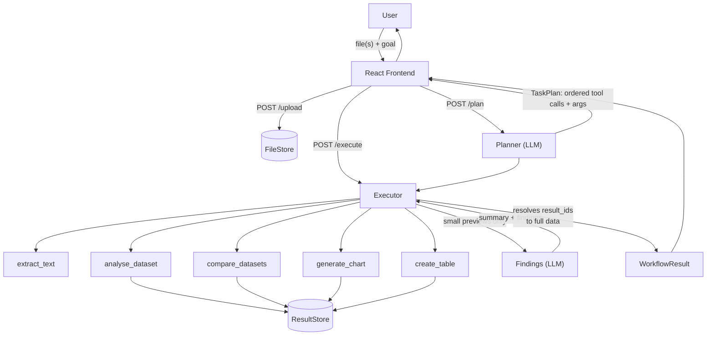

# AI Workbench

**Turn uploaded files into useful results — automatically.**

Upload a PDF, CSV, or Excel file, describe what you want in plain language, and AI Workbench plans a workflow, executes it, and hands back a summary, a table, a chart, or a finding. Built for [GIBC V2](https://gibc-v2.devpost.com/), Track 03 (Open).

## The problem

Getting an actual answer out of a spreadsheet or report usually means several manual steps: open the file, understand its columns, do the calculation, filter the results, maybe build a chart. AI Workbench collapses that into one step: **upload → describe your goal → get the result.**

It is deliberately *not* a general-purpose chatbot or agent. It only does five things, on files you give it:

| Capability | What it means | How it's built |
|---|---|---|
| **Understand** | Summarise or answer questions about a document | `extract_text` (PDF) — the model reads the real text and synthesises an answer, no separate "summarise" tool needed |
| **Analyse** | Calculations, filters, comparisons on structured data | `analyse_dataset`, `compare_datasets` — pandas does the arithmetic, never the LLM |
| **Transform** | Reshape raw data into a filtered/computed result | The same data tools above, formatted via `create_table` |
| **Visualise** | Turn data into a chart | `generate_chart` — shapes the data; actual rendering happens client-side in React |
| **Decide** | Call out the finding that actually matters | A second, small LLM call that narrates already-computed results — not a tool, since this is exactly what an LLM is naturally good at (unlike arithmetic) |

## How it's different from just asking ChatGPT

A chatbot turns a question into an answer. AI Workbench turns a **goal** into an **executable plan**, then runs it:

```
goal + files → AI plans a sequence of tool calls (with real arguments)
            → the plan is executed deterministically (pandas/PyMuPDF do the work)
            → a second LLM call narrates the already-computed result
            → table / chart / summary / findings
```

The plan the user sees *is* what executes — not a decorative summary of what an independent agent did. See [Architecture](#architecture) for why that distinction mattered enough to build around.

## Architecture



Two decisions carry the whole design:

1. **One plan, deterministically executed.** The planner LLM produces a `TaskPlan` of concrete tool calls (tool name + real arguments), not prose. A plain Python executor runs each call in order — no second, independent agent re-deciding what to do. What the UI shows as "workflow used" is literally what ran.
2. **Bulk data never round-trips through the LLM.** Tools that compute a table (`analyse_dataset`, `compare_datasets`) store the full result server-side and hand the LLM only a `result_id` + a 5-row preview. Later steps reference `$result_of_step_N` instead of the LLM re-typing data. The final result's full rows are resolved from the store at the API layer — the LLM never authors the numbers a user sees, it only decides what to compute and narrates the outcome.

## Tech stack

| Layer | Technology |
|---|---|
| Frontend | React, TypeScript, Vite, Tailwind CSS v4, Recharts |
| Backend | FastAPI |
| AI | [Pydantic AI](https://ai.pydantic.dev/), OpenRouter (`openai/gpt-4o-mini`) |
| Data | pandas, openpyxl |
| Documents | PyMuPDF |
| Testing | pytest (30 tests, backend fully covered) |

## Setup

**Backend:**

```bash
python -m venv .venv
.venv\Scripts\activate        # Windows
pip install -r requirements.txt
cp .env.example .env          # optional: add OPENROUTER_API_KEY to use a real model
uvicorn backend.main:app --reload
```

Without `OPENROUTER_API_KEY`, the planner runs against Pydantic AI's `TestModel` (schema-valid stub output, no network call) — the app still runs end-to-end for development without a key.

**Frontend:**

```bash
cd frontend
npm install
cp .env.example .env          # optional: override VITE_API_BASE_URL
npm run dev
```

## Try it

`http://127.0.0.1:8000/docs` gives an interactive API console. Or use the real example files under [`examples/`](examples/) with the three demo scripts in [`docs/demo-script.md`](docs/demo-script.md) — each is verified end-to-end against the real model in `tests/test_demo_scenarios.py`.

## Test

```bash
pytest
```

## Limitations

- **No persistence.** Uploaded files and computed results live in-memory for the life of the process — restart the server and they're gone. Fine for a hackathon demo, not for production.
- **Single process, no auth.** No multi-user isolation; anyone hitting the API can see any uploaded file's metadata via `GET /files`.
- **Five tools, not eight.** The original design sketched 8 named tools including `summarise_document` and `find_information`. Both turned out to be redundant with the executor's own final synthesis after `extract_text` — dropped in favor of 5 real, necessary tools.
- **Frontend not yet verified live in a browser** on the development machine used to build this — `npm run dev`/`npm run preview` reliably triggers a `CRITICAL_PROCESS_DIED` Windows crash, root cause not yet identified. The frontend TypeScript compiles clean and consumes a fully-tested API; live verification (and the demo video) is the last remaining step, to be done once resolved or on different hardware.

## AI usage disclosure

This project was built with substantial assistance from **Claude Code** (Anthropic, model Claude Sonnet 5), per GIBC V2's disclosure requirement. Concretely: the overall architecture (the planner/executor split, the `result_id`-based data-flow design, the tool set) was designed collaboratively — proposed, explained, and reviewed at each phase — and effectively all source code (backend, frontend, tests, example-data generation) was written by Claude Code based on that design. The product concept, scope decisions, and direction throughout were the author's own. Every phase was verified with real tests before being committed, most run against the real OpenRouter model rather than mocked.
